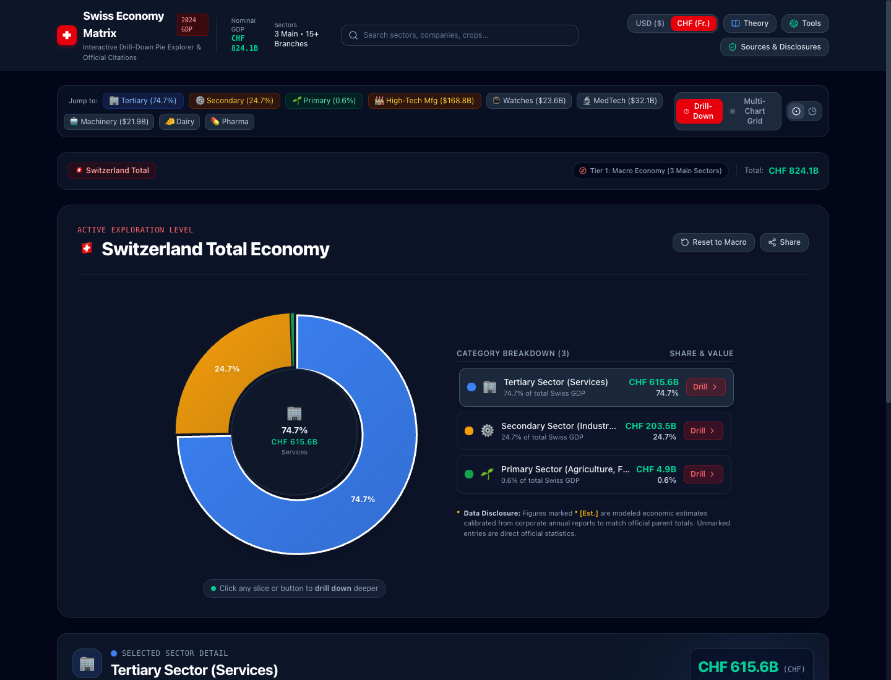

# 🇨🇭 Swiss Economy Matrix — Interactive Drill-Down Pie Explorer



> 🚀 **Live Demo**: [https://swiss-economy-matrix.web.app](https://swiss-economy-matrix.web.app) (or [https://swiss-economy-matrix.firebaseapp.com](https://swiss-economy-matrix.firebaseapp.com))

An intuitive, high-performance web application designed to visualize Switzerland's Gross Domestic Product (GDP) and economic sector hierarchy through animated, multi-tier drill-down pie and donut charts.

---

## 🌟 Key Features

1. **Intuitive Hierarchical Drill-Down Visualizer**:
   - **Click Any Slice**: Smoothly animates into the corresponding sub-category pie chart.
   - **Interactive Breadcrumb Navigation**: Visual path (`Switzerland Total ($936.5B)` > `Primary Sector ($5.6B)` > `Agriculture ($4.37B)` > `Dairy Farming ($1.97B)` > `AOP Cheeses ($1.15B)`).
   - **Keyboard Navigation**: Press `Escape` or `Backspace` to step back up one level.
   - **Switchable Chart Types**: Toggle seamlessly between Donut Chart and Classic Pie Chart.
   - **Hover Insights**: Slice expansion, center hub statistics, percentages, and absolute values in both **USD ($)** and **CHF (Swiss Francs)**.

2. **Dedicated Multi-Chart Grid Matrix**:
   - **3 Core Sectors Suite**: 3 distinct side-by-side pie charts breaking down the internal Gross Value Added (GVA) of Primary, Secondary, and Tertiary sectors.
   - **Granular Primary Sector Suite**: Dedicated multi-pie chart matrix breaking down Agriculture, Forestry & Logging, Freshwater Fishing, Dairy & Cheese, Livestock & Meat, and Viticulture & Orchards.
   - **1-Click Deep Exploration**: Jump directly from any overview mini-pie chart into full interactive focus mode.

3. **Always-Quoted Official Sources & Direct Verification Links**:
   Every sector, card, and modal quotes the official administrative source and provides direct links to verify data:
   - **Swiss Federal Statistical Office (FSO / BFS / OFS)**: [National Accounts (ESVG 2010)](https://www.bfs.admin.ch/bfs/en/home/statistics/national-economy/national-accounts.html)
   - **Federal Office for Agriculture (FOAG / BLW)**: [Swiss Agricultural Report (Agrarbericht)](https://www.agrarbericht.ch/)
   - **Federal Office for the Environment (FOEN / BAFU)**: [Forest Report & Fishery Statistics](https://www.bafu.admin.ch/bafu/en/home/topics/forest.html)
   - **The Observatory of Economic Complexity (OEC)**: [Switzerland Trade & Complexity Profile](https://oec.world/en/profile/country/che)
   - **World Bank Open Data**: [Switzerland Macro Accounts](https://data.worldbank.org/country/switzerland)
   - **Trading Economics**: [Switzerland GDP Indicators](https://tradingeconomics.com/switzerland/gdp)

4. **Educational Theory Guide**:
   - In-depth modal explaining the **Three-Sector Theory** (Fisher, Clark, Fourastié).
   - Analysis of why these 3 sectors form the global standard adopted by the UN and World Bank.
   - Modern expansion into **Quaternary** (Knowledge & R&D) and **Quinary** (Leadership & Governance) sectors.
   - The Swiss context: Why a 0.6% Primary Sector receives over CHF 2.8B annually in constitutional direct payments (*Direktzahlungen*) for food security, avalanche/erosion prevention, and Alpine landscape preservation.

5. **Curated Directory of Existing Online Visualization Tools**:
   Direct links and usage profiles for **Agrarbericht**, **STAT-TAB**, **OEC**, and **Trading Economics**.

---

## 📊 Economic Data Summary (2024 Nominal GDP: ~$936.5B USD)

```
🇨🇭 Switzerland Total GDP ($936.5B USD / ~CHF 824B)
├── 🏢 Tertiary Sector (Services) — 74.7% ($699.6B)
│   ├── Real Estate & Professional/Scientific Services ($167.9B)
│   ├── Transport, IT, Education & Tourism ($160.9B)
│   ├── Wholesale, Retail & Global Commodity Trading ($153.9B)
│   ├── Financial & Insurance Activities ($129.4B)
│   └── Health Care & Social Work ($87.5B)
│
├── ⚙️ Secondary Sector (Industry & Manufacturing) — 24.7% ($231.3B)
│   ├── High-Tech & Precision Manufacturing ($168.8B)
│   │   ├── Chemicals & Pharmaceuticals ($77.6B)
│   │   ├── Precision Instruments & MedTech ($32.1B)
│   │   ├── Luxury Watchmaking & Horology ($23.6B)
│   │   ├── Machinery, Electrical & Robotics ($21.9B)
│   │   └── Food Processing & Confectionery ($13.6B)
│   ├── Construction & Civil Infrastructure ($40.5B)
│   └── Energy, Water & Utilities ($22.0B)
│
└── 🌱 Primary Sector (Agriculture, Forestry & Fishing) — 0.6% ($5.6B)
    ├── Agriculture (Crop & Livestock) ($4.37B, 78.0%)
    │   ├── Dairy Farming & Milk Production ($1.97B, 45.1%)
    │   │   ├── AOP Artisanal Cheeses (Gruyère, Emmentaler) ($1.15B)
    │   │   ├── Fluid Pasture Drinking Milk ($0.52B)
    │   │   └── Butter, Cream & Yogurt ($0.30B)
    │   ├── Cattle, Beef, Pork & Poultry ($1.22B, 27.9%)
    │   ├── Cereal Crops, Sugar Beets & Potatoes ($0.61B, 14.0%)
    │   ├── Viticulture & Orchards / Swiss Wine ($0.44B, 10.1%)
    │   └── Horticulture & Alpine Herbs ($0.13B, 2.9%)
    ├── Forestry & Timber Logging ($1.15B, 20.5%)
    │   ├── Sawn Timber & Industrial Sawlogs ($0.62B)
    │   ├── Energy Wood & Wood Pellets ($0.41B)
    │   └── Protective Forest Management ($0.12B)
    └── Freshwater Fishing & Aquaculture ($0.08B, 1.5%)
        ├── Commercial Lake Catch (Lake Geneva, Neuchâtel, etc.) ($0.038B)
        ├── Freshwater Aquaculture & Trout Farms ($0.034B)
        └── River Restocking & Hatcheries ($0.008B)
```

---

## 🚀 Getting Started

### Prerequisites
- Node.js (v18+)
- npm (v9+)

### Installation & Run

```bash
# Install dependencies
npm install

# Start development server
npm run dev

# Build for production
npm run build

# Preview production build
npm run preview
```

The app runs by default at `http://localhost:5173/`.
